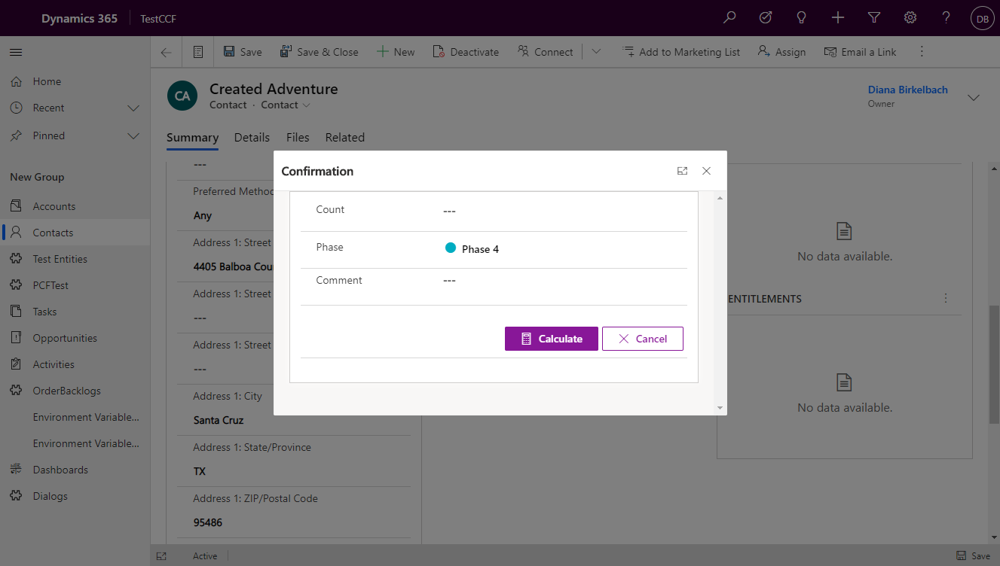
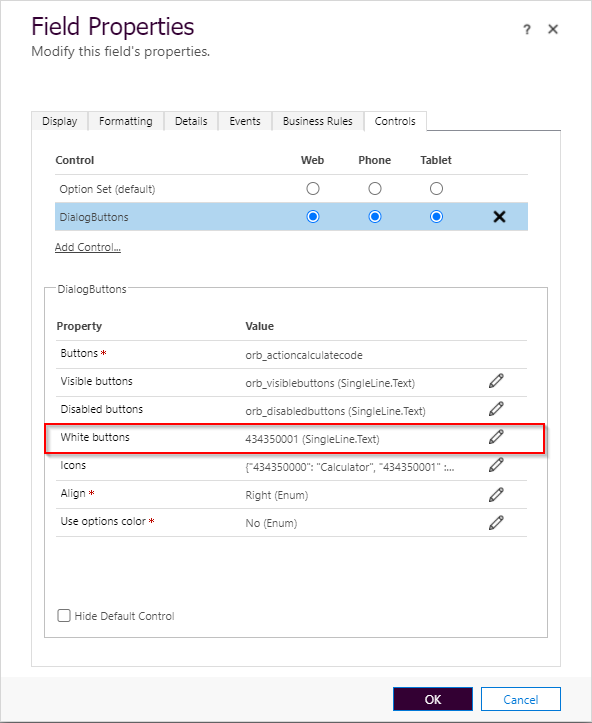
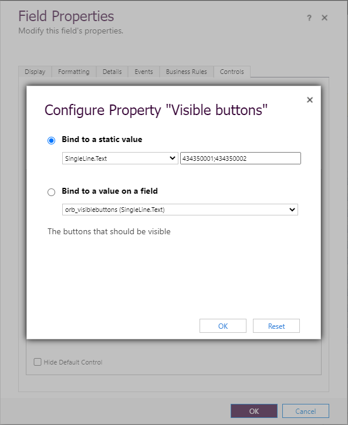
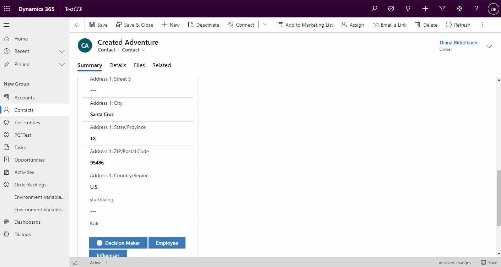
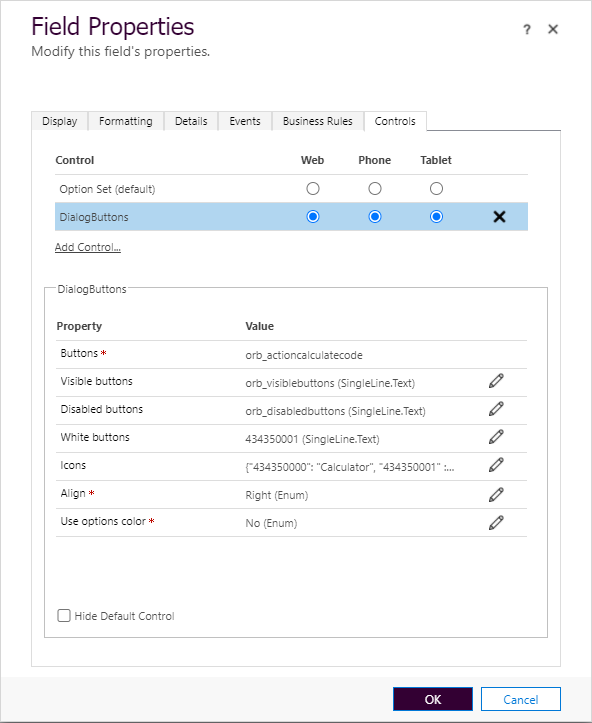
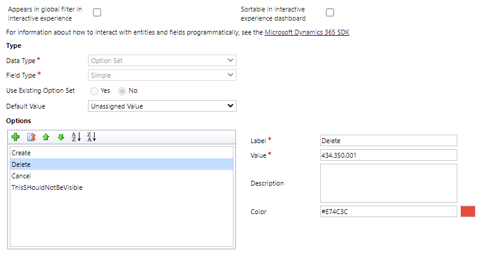
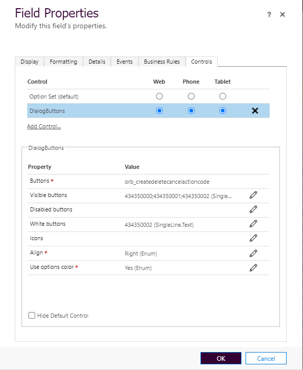
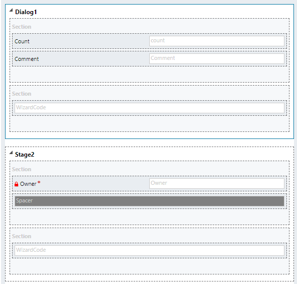
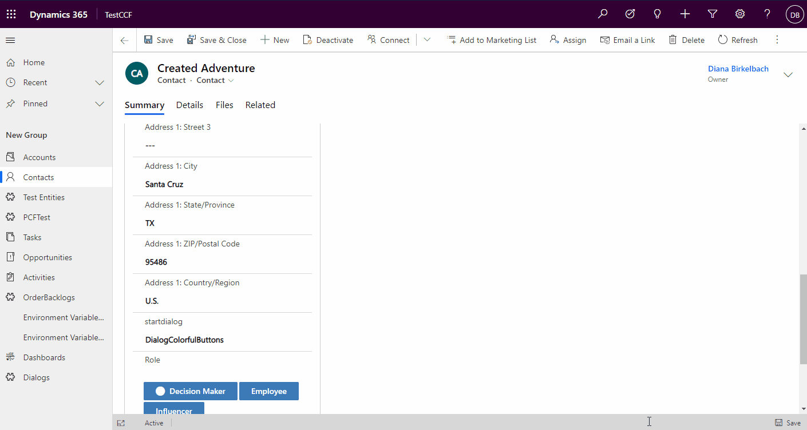

# Dialog Buttons

A PCF to allow a little more flexibility to define buttons on a form. The target is to bring more flexibility to the Form used as Dialogs (as explained in my blog Transform Forms into Dialogs and more..." (https://dianabirkelbach.wordpress.com/2020/10/14/transform-forms-into-dialogs-and-more/)



## Customizing

The main attribute for this PCF has to be an **"OptionSet"**.
As a base for the PCF I've took an OptionSet, because that way the labels can be translated and because it allows me to define colors.

The parameters in the manifest are:
 - **buttons** - that's the main attribute, and of type OptionSet. Each option in the optionset will be shown as a button
 - **visibleButtons** - parameter of type text, containing the values of the optionsets that should be visible. 
    - The values should be separated with ";". 
    - If the paramter is not set, all the options will be shown
    - Important: the values of the optionsset are not allowed to have formatting characters, plase remove thousand separators.
    - Example: "434350000;434350001"
- **disabledButtons**  - parameter of type text, containing the optionset values for the buttons that should be deactivated. 
    - Please remember that the parameters can be fixed but can be also dynamic, by binding them to attributes. That way, it is a mechanism to change the disabled value at runtime.
- **whiteButtons** - parameter defining the buttons which should be shown like a "Cancel Button". It will have a white background, but on "hover" or "click" will get a coloured background.
    - the same logic will be applied by defining the color #ffffff (white) in the option customizing
- **icons** - a parameter of type text, where the content should be a JSON. For each optionset value, you can choose one of the FluentUI Icons.
    - Example: '{"434350000": "Calculator", "434350001" : "Cancel"}'
    - FluentUI icons library: https://developer.microsoft.com/en-us/fluentui#/styles/web/icons#available-icons
- **align** - allows to align the buttons to the left, center or right. Default is "Right"
- **useOptionsColor** - in case you need to change the color for the buttons, you can change this parameter to "Yes". In that case, the color defined for each option in the optionset (buttons) will be reflected. 
    - The default is "No", which means that the buttons will have the color "mainColor" from the defined "Theme".

## Trigger an action and reset

The buttons are bound to an optionset. When a button is clicked, the value for the optionset attribute is changed to the value corresponding to the button. In order to reset the buttons for the next click, the "Dialog Buttons" PCF will **autotrigger a cleanup after a second**: the value will be set to null. You don't need to do anything for that. Just remember, that after the value was changed, a second change will be triggered: this time with the value "null", which you should ignore when inspecting the actions.


# Examples

## Cancel button


This way the **Cancel** Button is getting a white background:


## Static binding of properties (example visibleButtons)

In case you have more options in the OptionSet, and some are not supposed to be used in this control, just define the values by using the fixed values.

This can be applied to the other properties like disabledButtons, whiteButtons.

## Dynamic disabling the buttons

Sometime you have to disable buttons, until some conditions are fullfilled. In that case, it could be usefull to bind this parameter to another attribute in the form. That way, you can use formScripting and change the value of the attribute bound to the disabledButtons. 

```javascript
if(buttonShouldBeDisabled){
    formContext.getAttribute("orb_disabled").setValue("434350000;434350002")
}
else{
    formContext.getAttribute("orb_disabled").setValue("434350001");
}

}
```

Important: I've noticed a bug: if you set the value to null, the PCF updateView won't be triggered, so the button won't be dissabled. To work arround that, set the value to something like ",". That won't break the PCF, but the button will be disabled.



# Examples for

&#10071; &#10071; &#10071; In the project there is a folder named **FormScripting** when you can find examples which can be used on the form. 

In order to avoid writing the same code over and over again, there is a "FormDialog.js", having some base functionality for working with the form transformed in a dialog. It is a kind of library which is called by passing the **formContext**, the **attributeNames** that will be used to grab the input, the name of the attribute of type optionset primary bound to the PCF "*actionAttributeName*" and if it should automatically set all these attributes on submit mode Never **autosetOnSubmitModeNever**. The result contains: 
 - **getIsDirty** : it tells if the defined attributes are changed
 - **attributes** : an array with the attributes corresponding to the defined attribute names
 - **applyDisabled** : when working with dynamic "disabledButtons", you can use this method to set the value for the attribute bound to disabledButtons, by defining a function which returns which attributes should be disabled. It wil automatically attach to "onChange" of this attributes, and recalculate the new disabled buttons.
 ```javascript
  const dialogs = FormDialog(formContext, ["orb_comment", "orb_count", "orb_optionsetcode"], "orb_actioncalculatecode",true);

 dialogs.applyDisabled("orb_disabledbuttons", function(){
        return dialogs.getIsDirty()===true ? null : "434350000";
    });
 ```
 - **applyVisible** : similar to applyDisabled, but it sets the visibleButtons parameter
 - **setActions** : this is a kind of declarative definition of the actions. The parameter is a JSON definition of the functions to be called when the buttons are clicked. It will automatically attach to the OnChange of the "buttons" attribute, and call the actions.

Example:
 ```javascript
  dialogs.setActions({
        "434350000" : function(){ //calculate                    
           //do something here
        }, 
        "434350001" : function(){//cancel
            formContext.ui.close();
        }
    })
 ```

 You can find the "library" here: https://github.com/brasov2de/DialogButtons/blob/main/FormScripting/FormDialog.js, together with some examples of using it:
  - Calculate1.js - shows how to dinamically disable buttons
  - CreateDelete2.js works with colors and 3 actions
  - Wizard.js is similar to a Wizard.

 ## Example 1: Disabled buttons

 The code I've use to disable the "Calculate" button can be found here: https://github.com/brasov2de/DialogButtons/blob/main/FormScripting/Examples/Calculate1.js.

 The customizing for the pCF in that case:


And the result:


## Example 2:

The second example has several colors for the buttons. For that I use the customizing for the options:



The PCF customizing:


The code for form scripting is basically just setting the colors:
```javascript
function Dianamics_CreateDelete_Onload(executionContext){
    const formContext = executionContext.getFormContext();

    const dialogs = FormDialog(formContext, ["orb_comment", "orb_count"], "orb_createdeletecancelactioncode",true);
    dialogs.setActions({
        "434350000" : function(){ 
            // calculate here                  
        }, 
        "434350001" : function(){
            //delete code here            
        },
        "434350002" : function(){
            formContext.ui.close();
        }
    })
}
```
You can find it here:
https://github.com/brasov2de/DialogButtons/blob/main/FormScripting/Examples/CreateDelete2.js

And the result:


## Example 3

Here I've tried to make a wizard, by switching the visibility of the tabs. 

The customizing:


The form scripting:
https://github.com/brasov2de/DialogButtons/blob/main/FormScripting/Examples/Wizard.js

The result:



 


